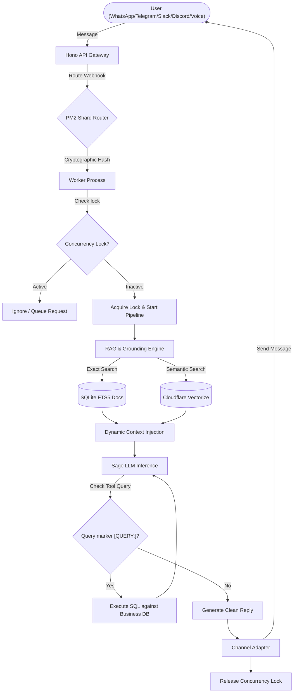

<p align="center">
  
</p>

<h3 align="center">Multi-Channel Autonomous AI Messaging Platform for Businesses</h3>

<p align="center">
  <a href="https://mesage-api.devblocktechnologies.com/health">
    
  </a>
  <a href="https://mesageai.devblocktechnologies.com">
    
  </a>
  
  
  
</p>

---

## 📖 Overview

**MesageAI** is a production-ready, multi-channel autonomous conversational agent and storefront platform for businesses. It consolidates interactions from **WhatsApp, Telegram, Discord, Slack, Web Widgets, and Voice Calls** into a unified workspace. 

Powered by a highly contextualized Sage Inference LLM, MesageAI utilizes hybrid RAG (semantic vector search + full-text search) and dynamic SQL tool execution to serve as an active virtual agent capable of querying inventory, managing bookings, checking order states, and processing checkouts.

---

## 📐 Architecture & Pipeline Flow

The backend scales horizontally across multiple CPU cores using PM2 clustering, deploying a sharded event manager for real-time WebSockets and persistent bot connections.



### Directory Structure

```
mesage-ai/
├── server/              # Node.js + Hono backend (Port 8720)
│   ├── src/
│   │   ├── routes/          # API route handlers (admin, payments, storefront, etc.)
│   │   ├── pipeline/        # AI pipeline - messages, tool execution, vector search
│   │   ├── whatsapp/        # Baileys multi-session WhatsApp manager
│   │   ├── telegram/        # Telegraf multi-bot webhook manager
│   │   ├── channels/        # Discord, Slack, Voice channel managers
│   │   ├── lib/             # SQLite client, business hours, customer analysis
│   │   ├── tools/           # Dynamic database query tools registry
│   │   └── orchestrator/    # PM2 process worker cluster orchestrator
│   ├── data/                # Local SQLite storage + session files
│   └── api-tests/           # REST API E2E integration tests (.http files)
├── web/                 # Next.js 15 Web Dashboard (Port 3000)
│   └── src/
│       ├── app/
│       │   ├── dashboard/       # Main business hub (Overview, chats, broadcasts, etc.)
│       │   ├── admin/           # Platform admin panel (40+ operational pages)
│       │   ├── (root)/          # Public static pages & auth
│       │   ├── (personal-ai)/   # Personal chat & playground
│       │   └── store/           # Public customer storefronts
│       ├── lib/                 # Shared utilities, hooks, API wrappers
│       └── providers/           # App context providers (Auth, theme, query)
└── docs/                # Architecture diagrams & founders agreements
```

---

## ⚡ Key System Features

### 1. Unified Message Routing
* **WhatsApp**: Supports multi-session management via Baileys. Leverages pairing codes and QR codes, automatic state recovery, and group message parsing with @mention targeting.
* **Telegram**: Bot manager utilizing webhook routing via BotFather setup.
* **Discord & Slack**: Secure socket mode and webhook adapters supporting bi-directional communication.
* **Voice Calls**: Integration with DevBlock Voice Workers for streaming real-time voice conversations.

### 2. Intelligent AI Pipeline
* **Cluster Sharding**: WhatsApp and Telegram bot connection sockets are sharded across workers based on a cryptographic hash of the business ID to ensure process isolation.
* **Concurrency Lock**: Conversation-level mutexes block concurrent LLM requests for the same user, preventing duplicate processing.
* **SQL Tool Grounding**: The AI queries database tables (menu-lookup, order-status, catalog-lookup) by Outputting `[QUERY: tool_name parameters]` tokens. The pipeline parses the token, executes SQL against SQLite, and feeds structural results back to the LLM.
* **Hybrid RAG**: Fast text search queries with SQLite FTS5 combined with semantic distance searches using Cloudflare Vectorize.

### 3. Commerce & Operations
* **Dynamic Storefronts**: Modular checkouts custom-built for Restaurants (menus), Retailers (products), and Services.
* **Integrated Payments**: Powered by Flutterwave. Automated wallet balance deduction per message credits and payout workflows.
* **Automated Weekly Insights**: Background cron analyses conversations, metadata, and sales metrics, creating localized reports using the LLM.

---

## ⚙️ Environment Configuration

Set up these variables in your environment files to configure the application services:

| Variable | Description | Default |
|----------|-------------|---------|
| `SAGE_API_KEY` | Sage Inference API token | *Required* |
| `INTERNAL_SECRET` | Admin inter-process webhook verification key | *Required* |
| `DB_PATH` | SQLite database directory path | `./data/mesage-ai.db` |
| `FLUTTERWAVE_SECRET_KEY`| Flutterwave API Secret Key for credit & storefront checkouts | *Required* |
| `WEBHOOK_BASE` | Public endpoint domain for Telegram bot webhooks | `https://mesage-api.devblocktechnologies.com` |
| `CF_ACCOUNT_ID` | Cloudflare Account ID for Vectorize search index | *Required* |
| `VECTORIZE_INDEX` | Target Cloudflare Vectorize index name | *Required* |
| `NEXT_PUBLIC_API_BASE` | Frontend API client base URL | `http://localhost:8720` |

---

## 🚀 Quick Start Guide

### Prerequisites
* Node.js **22+** (required for native `--env-file` environment loading)
* npm / pnpm

### 1. Server Setup
```bash
cd server
cp .env.example .env    # Configure your api credentials
npm install
npm run dev             # Hot-reload developer server on http://localhost:8720
```

### 2. E2E Testing
```bash
cd server
npm run build

# Boot server in testing profile
DB_PATH=./data/test-e2e.db npm start

# Execute integration suite (in another terminal)
DB_PATH=./data/test-e2e.db node e2e-test.mjs
```

### 3. Frontend Setup
```bash
cd web
cp .env.local.example .env.local
npm install
npm run dev             # Boot dashboard client on http://localhost:3000
```

---

## 📦 Production Deployment

### Process Management (PM2)
The server relies on PM2 in cluster/fork mode to handle worker distribution. Refer to `ecosystem.config.cjs` in the project root:

```bash
# Start backend cluster
npm run pm2:start

# Monitor live logs
pm2 logs mesage-ai-server
```

### Frontend (Cloudflare Pages)
```bash
cd web
npm run pages:deploy
```

---

## 📄 License

Proprietary Software — Developed by **DevBlock Technologies Limited**. All rights reserved.
